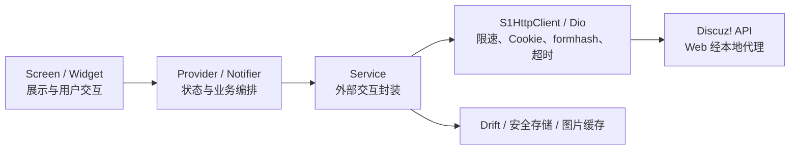

<p align="center">
  
</p>

# S1er

[](https://flutter.dev/)
[](https://dart.dev/)
[](LICENSE)

S1er 是使用 Flutter 开发的非官方 Stage1st（S1）论坛客户端。项目直接对接 Discuz! Mobile API 与必要的论坛页面接口，采用 Material Design 3，并以同一套代码覆盖 Web、Android、iOS、Windows、macOS 与 Linux 目标。

> [!IMPORTANT]
> 本项目与 Stage1st 官方无隶属、授权或背书关系。使用客户端时仍须遵守 Stage1st 的服务条款与社区规则；论坛接口、游客权限或页面结构变化都可能影响部分功能。

## 项目状态

项目仍在积极开发中。目前主要以 Web 和 Android 作为关键路径验收目标；仓库包含其余 Flutter 平台工程，但发布前仍需在对应系统完成签名、构建与真机回归。

### 已实现

- 论坛浏览：版块、主题列表、主题详情、分页、页码跳转与楼层定位
- 内容渲染：常用 BBCode、引用、代码、列表、链接、S1 表情与帖子图片查看
- 账号会话：API 表单登录、会话恢复、退出登录与个人资料
- 互动能力：回复、引用回复、投票、评分，以及主题和版块收藏
- 消息中心：查看私信与提醒
- 用户空间：查看用户主题与回复列表
- 本地体验：阅读历史与进度、回复草稿、投票状态、主题/字号设置
- Material You：亮色/深色主题与多套预设种子色
- 图片策略：按网络状态加载、原生磁盘缓存、缓存上限与清理
- 数据备份：导入/导出 L1 ZIP；不包含 Cookie、密码或图片缓存
- 诊断能力：Talker 日志与统一的网络、登录、维护状态提示

### 当前限制

- 黑名单支持本地主题/楼层/私信屏蔽，并可手动从 S1 网页黑名单只读导入；不反向写入论坛。
- 游客可见内容取决于 S1 当前开放的接口权限；登录后功能也受账号权限限制。
- Web 端因浏览器 CORS 限制，开发时必须同时运行仓库内的本地代理。
- 麻将脸表情资源以原 png/gif 形式入库于 `assets/emoticons/`（对齐 S1-Next，不转 WebP）；`scripts/download_emoticons.dart` 仅用于生成或更新后提交。

## 快速开始

### 环境要求

- [Flutter SDK](https://docs.flutter.dev/get-started/install) `>=3.4`
- Dart SDK `>=3.4 <4.0`（随 Flutter 提供）
- Git
- Android 开发需要 Android SDK 与 JDK 17
- iOS / macOS 开发需要 macOS 与对应版本的 Xcode

先确认环境并安装依赖：

```bash
git clone https://github.com/Shirolin/s1er.git
cd s1er
flutter doctor
flutter pub get
```

### 原生平台

连接设备或启动模拟器后：

```bash
flutter devices
flutter run -d <device-id>
```

原生端的登录 Cookie 通过 `PersistCookieJar` 持久化，落盘内容使用 AES-256-GCM 加密，密钥保存在系统安全存储中。

### Web

S1 接口不允许浏览器直接跨域访问。请先启动仅监听 `localhost` 的开发代理，再启动 Flutter Web。

Windows 可使用一键脚本：

```powershell
.\scripts\start_dev.ps1
```

也可以分别启动两个进程：

```bash
# 终端 1：CORS / Cookie 代理
dart run scripts/proxy_server.dart

# 终端 2：Flutter Web
flutter run -d chrome
```

无头环境可将第二条命令替换为：

```bash
flutter run -d web-server --web-port 8080 --web-hostname 0.0.0.0
```

代理默认监听 `http://localhost:19080`，只接受 `localhost` Origin。开发模式下未设置 `PROXY_AUTH_TOKEN` 时不校验 token；如需显式启用，请在代理与 Flutter 编译参数中使用同一值：

```bash
# 终端 1
dart --define=PROXY_AUTH_TOKEN=replace_with_a_random_value run scripts/proxy_server.dart

# 终端 2
flutter run -d chrome --dart-define=PROXY_AUTH_TOKEN=replace_with_a_random_value
```

> [!WARNING]
> 该代理仅用于本地开发：Cookie 保存在进程内存中，进程结束后即丢失。不要将它暴露到公网，也不要把真实账号、密码、Cookie 或 token 提交到仓库。

## 配置

应用配置通过 `--dart-define` 在编译期注入，定义集中在 `lib/config/env_config.dart`。

| Key | 默认值 | 说明 |
|---|---:|---|
| `TALKER_ENABLED` | `true` | 是否启用 Talker |
| `TALKER_LOG_LEVEL` | `error` | `error` 仅记录错误，`all` 记录全部请求与响应 |
| `TALKER_MAX_HISTORY` | `500` | 日志历史条数上限 |
| `BBCODE_PROFILE` | `false` | 正文 BBCode parse / Html build 耗时打点（滑动卡顿排查） |
| `PROXY_PORT` | `19080` | Web 代理端口；代理与 Flutter 端必须一致 |
| `PROXY_AUTH_TOKEN` | 空 | 非空时启用本地代理 token 校验 |
| `CONNECT_TIMEOUT` | `20` | 连接超时，单位为秒 |
| `RECEIVE_TIMEOUT` | `30` | 响应超时，单位为秒 |
| `SEND_TIMEOUT` | `30` | 发送超时，单位为秒 |
| `IMAGE_UPLOAD_TIMEOUT` | `120` | 外链图床上传超时（Web `/ext-upload` 同步），单位为秒 |

示例：

```bash
flutter run -d chrome \
  --dart-define=TALKER_LOG_LEVEL=all \
  --dart-define=TALKER_MAX_HISTORY=1000
```

如需修改代理端口，代理进程也必须使用相同的编译期定义：

```bash
dart --define=PROXY_PORT=19081 run scripts/proxy_server.dart
flutter run -d chrome --dart-define=PROXY_PORT=19081
```

代理还会读取 `S1_UPSTREAM_PROXY`，并依次兼容常见的 `HTTPS_PROXY`、`HTTP_PROXY` 与 `ALL_PROXY` 进程环境变量。

## 开发与验证

提交前至少运行：

```bash
dart format --output=none --set-exit-if-changed lib test scripts
flutter analyze
flutter test
dart run scripts/audit_m3.dart --fail-on-error
```

涉及平台或依赖变更时，再执行对应构建：

```bash
flutter build web
flutter build apk --release
```

分享卡导出（方案 C）：Native 依赖 `ironpress`（预编译 mozjpeg / oxipng / libwebp）；默认 WebP，可选 JPEG / PNG。Web 走浏览器 `canvas.toBlob` 或引擎 PNG。

### Pre-commit 质量检查（推荐）

安装后，每次 `git commit` 会跑质量检查；失败则阻止提交：

```bash
.\scripts\install_precommit.ps1     # Windows
```

| 模式 | 用法 | 检查项 |
|------|------|--------|
| **full**（默认） | `git commit -m "..."` | format + analyze + test + M3 |
| **lite** | `$env:S1_PRECOMMIT="lite"; git commit -m "..."` | 仅 format + analyze（小改小修） |
| **skip** | `$env:S1_PRECOMMIT="skip"; git commit -m "..."` 或 `git commit --no-verify` | 跳过全部 |

钩子是指向 `scripts/pre-commit-hook.sh` 的薄包装，改脚本后一般不必重装。

`scripts/test_api.dart` 与 `scripts/test_post.dart` 会访问真实论坛接口，其中发帖测试可能产生真实内容。除非明确了解影响，否则不要把它们加入自动化测试或针对真实账号反复运行。

### 常用脚本

| 脚本 | 用途 |
|---|---|
| `scripts/start_dev.ps1` | 在 Windows 启动本地代理和 Chrome 开发环境 |
| `scripts/proxy_server.dart` | Web 开发用 CORS、Cookie 与图片代理 |
| `scripts/watch_proxy.ps1` | 监听代理文件变更并自动重启 |
| `scripts/download_emoticons.dart` | 生成/更新入库的 S1 麻将脸（六树 png/gif + manifest） |
| `scripts/audit_m3.dart` | 扫描 Material Design 3 合规问题 |
| `scripts/build.ps1` | Windows 交互式构建菜单；Release 项需要维护者签名配置 |

## 架构

项目遵循单向数据流：



| 目录 | 职责 |
|---|---|
| `lib/config/` | API、环境变量与资源域名等静态配置 |
| `lib/models/` | 不依赖 Flutter 的纯数据模型 |
| `lib/services/` | HTTP、认证、Drift、本地缓存与备份等外部交互 |
| `lib/providers/` | Riverpod 状态与服务编排 |
| `lib/screens/` | 路由页面与页面级组合 |
| `lib/widgets/` | 可复用 UI 组件 |
| `lib/theme/` | Material 3 主题、形状、排版与透明度 token |
| `lib/utils/` | BBCode、导航、格式化等纯工具逻辑 |
| `test/` | model、service、provider、screen、widget 与审计工具测试 |

关键设计约束：

- 所有外部请求统一经过 `S1HttpClient`，共享超时、每秒最多 2 请求的限速、Cookie 与 formhash 处理。
- Cookie 不进入 Drift，也不进入 `.s1backup.zip`；密码不做本地持久化。
- Web 代理只允许受控的 S1 资源域名，并将会话 Cookie 保留在内存中。
- UI 使用 Material 3 语义色与排版 token，不在页面和组件中硬编码色板或字号。

## 文档

- [备份格式 v1](docs/backup-format-v1.md)
- [API 参考](docs/api_reference.md)
- [技术栈现代化方案](docs/plans/2026-07-12-tech-stack-modernization.md)
- [Sentry 崩溃监控设置](docs/sentry-setup.md)
- [隐私政策](docs/privacy-policy.md)

## 贡献

Issue 与 Pull Request 都欢迎。在开始较大改动前，建议先创建 Issue 对齐范围，避免重复实现。

1. Fork 仓库并从最新 `main` 创建分支。
2. 只提交与问题直接相关的改动，并为行为变化补充测试。
3. 运行“开发与验证”中的质量关卡。
4. Commit 遵循 Angular 格式：`<type>(<scope>): <中文主题>`。
5. Pull Request 中说明问题、方案、验证结果、平台影响与必要截图。

可用类型：`feat`、`fix`、`docs`、`style`、`refactor`、`perf`、`test`、`chore`；`scope` 必填。

报告缺陷时，请附上复现步骤、预期/实际结果、Flutter 版本、目标平台以及已脱敏的日志。请勿公开提交账号、密码、Cookie 或其他个人信息。安全漏洞应优先通过 GitHub 的私密安全报告渠道告知维护者，不要在公开 Issue 中披露利用细节。

## 许可证

本项目采用 [GNU General Public License v3.0 or later](LICENSE) 发布。分发修改版本时，请同时提供对应源代码、保留许可证与版权声明，并明确标注修改内容。

第三方依赖和外部资源仍分别遵循其各自许可证；Stage1st 名称、内容与相关标识的权利归其权利人所有。

## 致谢

- [Stage1st](https://stage1st.com/) 提供论坛服务与社区内容。
- Flutter、Dart 及本项目使用的所有开源依赖与贡献者。

## 支持项目

如果你觉得 S1er 有帮助，欢迎支持开发者：

- 爱发电 (Afdian)：[https://ifdian.net/a/shirolin](https://ifdian.net/a/shirolin)
- Ko-fi：[https://ko-fi.com/shirolin](https://ko-fi.com/shirolin)
