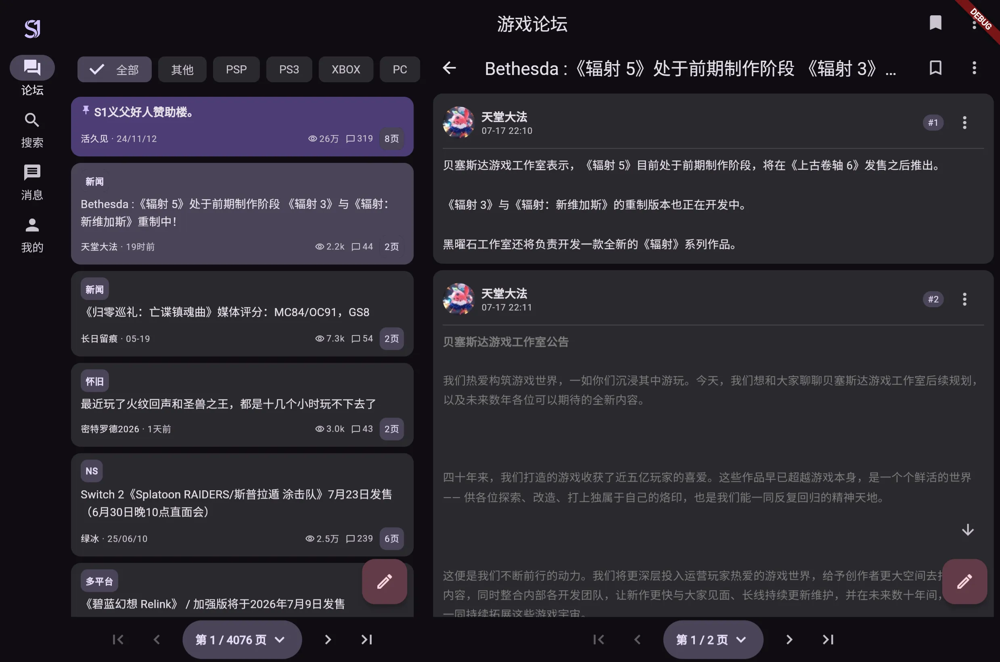
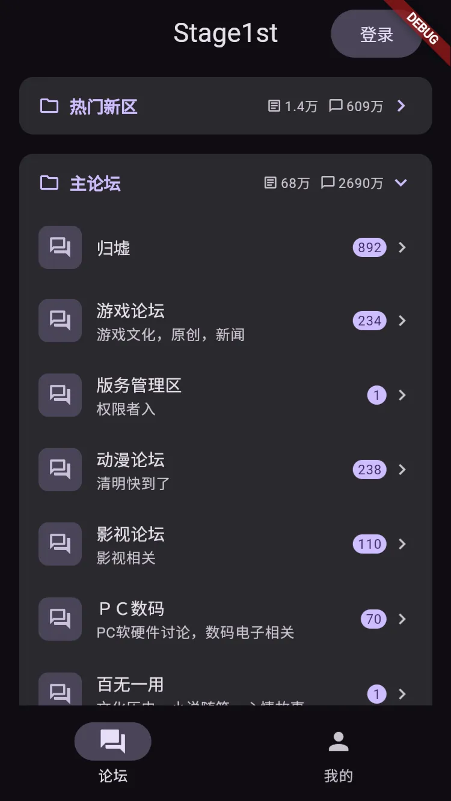
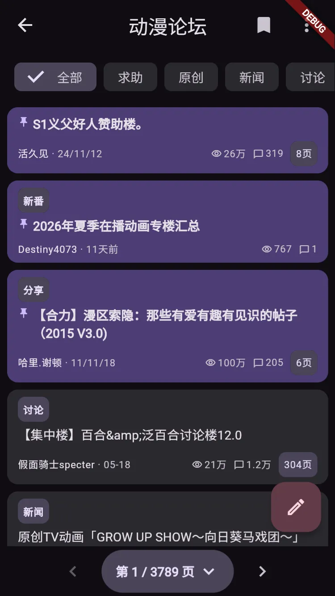
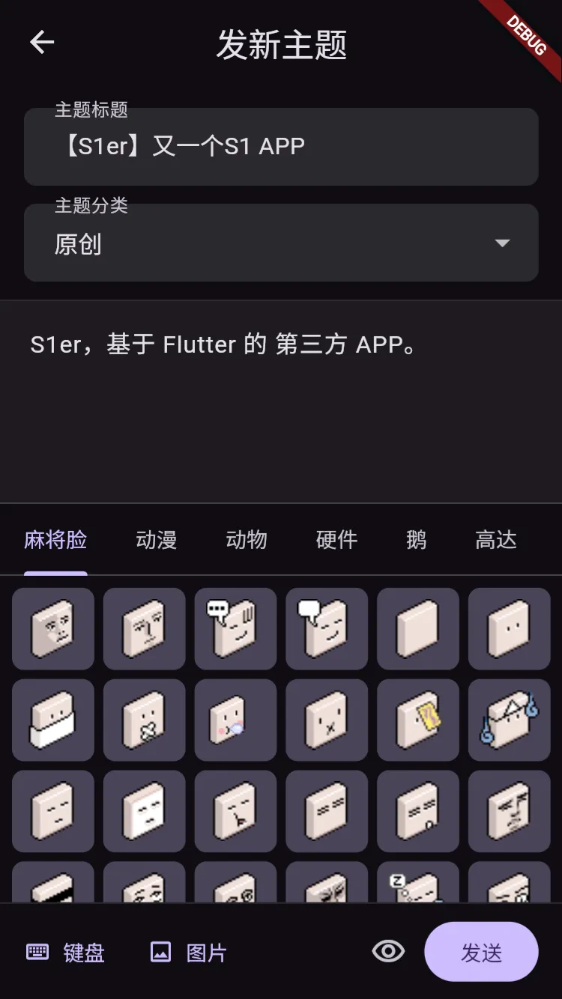

<p align="center">
  
</p>

# S1er

[](https://flutter.dev/)
[](https://dart.dev/)
[](docs/release/latest.json)
[](LICENSE)

S1er 是使用 Flutter 开发的非官方 Stage1st（S1）论坛客户端。对接 Discuz! Mobile API，采用 Material Design 3。

> [!IMPORTANT]
> 本项目与 Stage1st 官方无隶属、授权或背书关系。使用客户端时仍须遵守 Stage1st 的服务条款与社区规则；论坛接口、游客权限或页面结构变化都可能影响部分功能。

## 平台支持

| 平台 | 工程 | 验收状态 | 说明 |
|:---|:---:|:---|:---|
| Web | 有 | **已验证** | 本地调试（需 CORS 代理） |
| Android | 有 | **已验证** | 可打 APK |
| Windows | 有 | **已验证** | 可打 zip（x64） |
| iOS | 有 | 未验证 | 可自构建，未做系统验收 |
| macOS | 有 | 未验证 | 同上 |
| Linux | 有 | 未验证 | 同上 |

当前版本 **0.1.1（Beta）**。未验证平台可能存在构建或运行差异，欢迎反馈。版本约定见 [应用升级与版本管理](docs/release/README.md)。

## 截图

<p align="center">
  
</p>

<p align="center">
  
  
  
</p>

更多界面见 [宣传站](https://shirolin.github.io/s1er/)。源图（PNG）保留在 [`assets/screenshot/`](assets/screenshot/)。

## 下载与体验

- **GitHub Releases**：[最新发布](https://github.com/Shirolin/s1er/releases/latest)
- **夸克网盘**：[https://pan.quark.cn/s/c05196e3c06a](https://pan.quark.cn/s/c05196e3c06a)（GitHub 下载慢时可走这里）
- **宣传站**：[https://shirolin.github.io/s1er/](https://shirolin.github.io/s1er/)
- **源码构建**：见下方「快速开始」

预编译包与渠道见 [`docs/release/latest.json`](docs/release/latest.json)；表中「未验证」平台通常需自构建。

## 功能亮点

- 版块 / 主题列表、帖子详情、分页与楼层定位
- BBCode、引用、麻将脸表情与帖子图片查看
- API 表单登录（含安全提问）、会话恢复与个人资料
- 回复、发帖、编辑、投票、评分与楼层举报；插图走 `p.sda1.dev` 外链图床
- 主题 / 用户搜索，私信与系统提醒
- 阅读历史、草稿、主题与字号、分享卡导出
- Material You：亮色 / 深色与多套种子色
- 本地黑名单与 L1 ZIP 备份（不含 Cookie / 密码 / 图片缓存）

完整能力与已知限制见 [CHANGELOG 0.1.0](CHANGELOG.md#010---2026-07-15)。推送通知、完整国际化与无障碍仍在规划中。

## 快速开始

环境要求：[Flutter SDK](https://docs.flutter.dev/get-started/install) `>=3.4`（Dart `>=3.4 <4.0`）。Android 需 JDK 17；iOS / macOS 需 Xcode。

```bash
git clone https://github.com/Shirolin/s1er.git
cd s1er
flutter pub get
flutter devices
flutter run -d <device-id>
```

克隆后即可构建；麻将脸资源已入库，无需单独下载。

**Web 开发**需同时运行本地 CORS 代理（Windows 可用 `.\scripts\start_dev.ps1`）。代理、`--dart-define`、脚本与宣传站维护见 [开发指南](docs/development.md)。

架构概览（Screen → Provider → Service → `S1HttpClient`）见 [架构说明](docs/architecture.md)。

## 文档

- [开发指南](docs/development.md)（代理、配置、脚本）
- [启动器图标](docs/app-icons.md)（成品图 / solid-plate 管线，勿混用）
- [架构说明](docs/architecture.md)
- [贡献指南](CONTRIBUTING.md)
- [备份格式 v1](docs/backup-format-v1.md)
- [API 参考](docs/api_reference.md)
- [应用升级与版本管理](docs/release/README.md)
- [Sentry 设置](docs/sentry-setup.md)
- [隐私政策](docs/privacy-policy.md)（[宣传站 HTML](https://shirolin.github.io/s1er/privacy.html)）
- [麻将脸来源说明](assets/emoticons/ATTRIBUTION.md)
- [安全审计摘要](docs/security-audit-2026-07-18.md)
- [Changelog](CHANGELOG.md)

## 贡献

Issue 与 Pull Request 都欢迎。较大改动请先开 Issue 对齐范围。流程、commit 规范、质量关卡与安全报告见 [CONTRIBUTING.md](CONTRIBUTING.md)。

## 许可证

本项目采用 [GNU General Public License v3.0 or later](LICENSE) 发布。分发修改版本时，请同时提供对应源代码、保留许可证与版权声明，并明确标注修改内容。

第三方依赖和外部资源仍分别遵循其各自许可证；Stage1st 名称、内容与相关标识的权利归其权利人所有。麻将脸表情资源来自 [kawaiidora/s1emoticon](https://github.com/kawaiidora/s1emoticon)（**该仓未附带许可证**），详见 [`assets/emoticons/ATTRIBUTION.md`](assets/emoticons/ATTRIBUTION.md)。

## 致谢

- [Stage1st](https://stage1st.com/) 提供论坛服务与社区内容。
- [kawaiidora/s1emoticon](https://github.com/kawaiidora/s1emoticon) 整理麻将脸库存与 Release 打包（无许可证声明；权利归原作者与社区）。
- Flutter、Dart 及本项目使用的所有开源依赖与贡献者。

## 支持项目

如果你觉得 S1er 有帮助，欢迎支持开发者：

- 爱发电 (Afdian)：[https://ifdian.net/a/shirolin](https://ifdian.net/a/shirolin)
- Ko-fi：[https://ko-fi.com/shirolin](https://ko-fi.com/shirolin)
