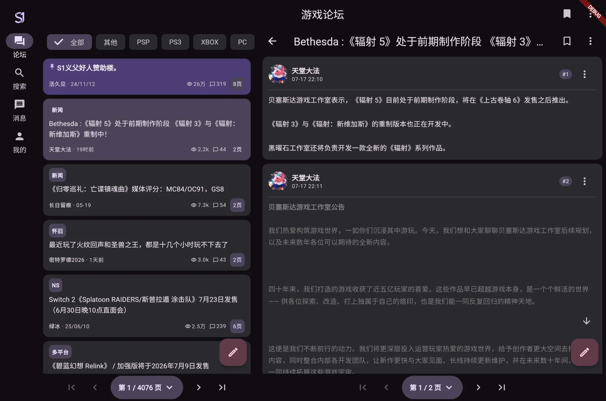
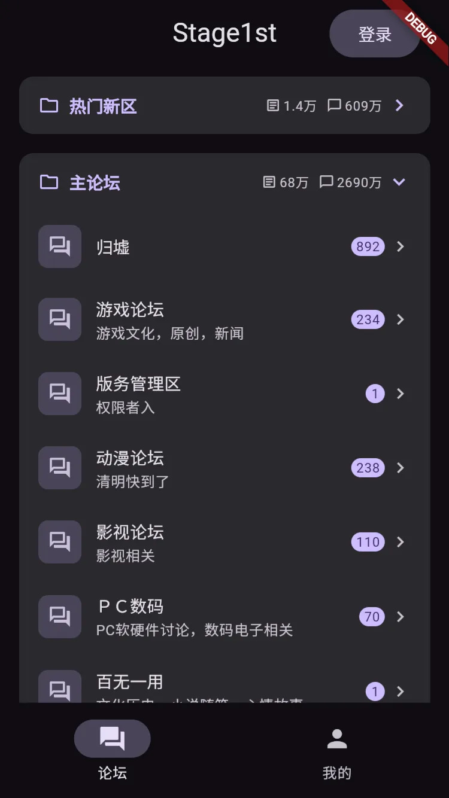
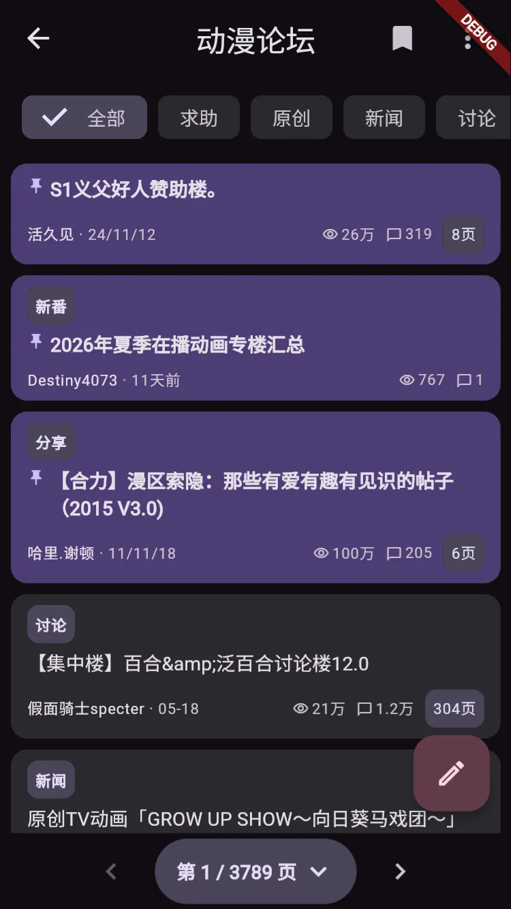
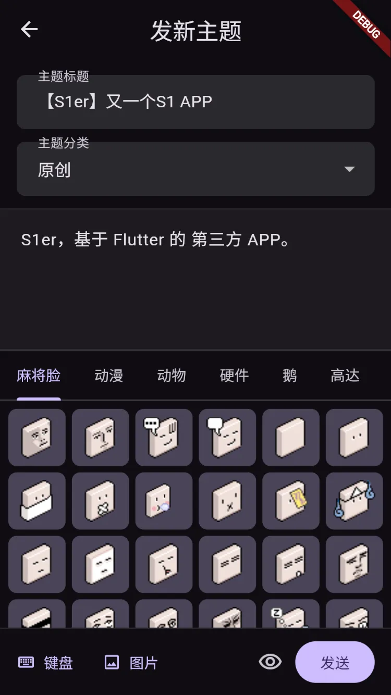

<p align="center">
  
</p>

# S1er

[](https://flutter.dev/)
[](https://dart.dev/)
[](docs/release/latest.json)
[](LICENSE)

S1er 是使用 Flutter 开发的第三方 Stage1st（S1）论坛客户端。基于 Discuz! Mobile API 构建，严格遵循 Material Design 3 (Material You) 设计规范，支持多平台跨端运行。

> [!IMPORTANT]
> 本项目与 Stage1st 官方无隶属、授权或背书关系。使用客户端时仍须遵守 Stage1st 的服务条款与社区规则；论坛接口、游客权限或页面结构变化都可能影响部分功能。

---

## 平台支持与构建矩阵

| 平台 | 工程支持 | 验收状态 | 交付物 / 运行说明 |
|:---|:---:|:---|:---|
| **Android** | 有 | **已验证** | 提供 Universal 通用包与针对性 ABI 精简包（`arm64-v8a` / `armeabi-v7a` / `x86_64`） |
| **Windows** | 有 | **已验证** | 提供 `x64` 免安装绿色包，支持窗口自绘标题栏与原生阴影 |
| **Web** | 有 | **已验证** | 浏览器直接访问；开发调试需启动本地 CORS 代理 |
| **iOS** | 有 | 未验证 | 已配置工程，可使用 Xcode 编译自构建 |
| **macOS** | 有 | 未验证 | 已配置工程，支持 macOS 原生构建 |
| **Linux** | 有 | 未验证 | 已配置工程，支持 Linux 原生桌面构建 |

*未验证平台可能存在构建或系统适配差异，欢迎提交反馈。版本约定见 [应用升级与版本管理](docs/release/README.md)。*

---

## 截图展示

<p align="center">
  
</p>

<p align="center">
  
  
  
</p>

更多界面预览与展示见 [S1er 官方宣传站](https://shirolin.github.io/s1er/)。原始无损截图（PNG）保存在 [`assets/screenshot/`](assets/screenshot/) 目录中。

---

## 下载与体验

- 🚀 **GitHub Releases（推荐）**：[最新版本发布页](https://github.com/Shirolin/s1er/releases/latest)
- ⚡ **夸克网盘镜像**：[https://pan.quark.cn/s/c05196e3c06a](https://pan.quark.cn/s/c05196e3c06a)（国内访问或下载慢时可用）
- 🌐 **Web 在线体验 / 宣传页**：[https://shirolin.github.io/s1er/](https://shirolin.github.io/s1er/)
- 🛠️ **源码自构建**：详见下方「快速开始」

预编译包与版本分发渠道清单记录于 [`docs/release/latest.json`](docs/release/latest.json)。

---

## 功能亮点

- 📖 **版块与主题浏览**
  - 版块 / 主题列表、帖子详情、智能分页与精准楼层定位
  - 边界翻页/滑动引导提示与 Haptic 触感反馈
  - 帖子大图原生全屏查看器，支持多级手势缩放与保存
- 💬 **富文本与麻将脸表情**
  - 高性能 BBCode 解析与 HTML 优化渲染，支持引用深度跳转与回复恢复
  - 内置完整麻将脸表情贴图（`assets/emoticons/` Local-First 加载）
- 🔑 **账号与会话管理**
  - API 表单登录（支持 Discuz 安全提问解答）与个人资料查看
  - 基于加密存储的 Cookie 会话自动恢复与 Formhash CSRF 安全防护
- ✏️ **发帖与互动**
  - 回复帖子、发表新帖、编辑已发帖子、发帖草稿箱自动保存
  - 投票、评分与楼层违规举报；插图默认 Discuz 论坛附件（支持 `p.sda1.dev` 外链备选）
- 🔍 **双层检索体系**
  - 论坛高级搜索：支持按版块、作者、时间范围组合过滤筛选
  - 本地页内搜索：当前列表内实时关键词匹配、词条高亮与匹配数统计
- 🚀 **升级检查与 Changelog**
  - 增量/全量版本升级检查（多 CDN 节点竞态拉取与短超时隔离）
  - Android 自动检测设备 ABI 并提示对应精简包下载
  - 升级后首次启动自动展示更新日志弹窗，设置页支持查看完整版本历史
- 🎨 **主题与个性化导出**
  - Material Design 3 (Material You) 动态主题，支持亮暗色模式与多种种子配色
  - 楼层多格式分享卡导出（内置 `ironpress` Native 编解码器与 Web Canvas 导出）
  - 桌面端支持固定目录导出与另存为对话框
- 🛡️ **数据隐私与本地备份**
  - 本地黑名单管理（支持主题列表屏蔽与楼层折叠）
  - 基于 Drift 数据库的 L1 ZIP 格式安全备份与恢复（严格排除敏感 Cookie、密码及图片缓存）

*详细能力演进与历史修补见 [CHANGELOG.md](CHANGELOG.md)。推送通知与完整无障碍支持在后续规划中。*

---

## 架构概览

S1er 遵循严格的单向数据流与分层架构，确保逻辑解耦与易测试性：

```text
┌─────────────────────────────────────────────────────────┐
│                    Screen / Widget                      │
└───────────────────────────┬─────────────────────────────┘
                            │ Read / Watch State
                            ▼
┌─────────────────────────────────────────────────────────┐
│               Riverpod Provider / Notifier              │
└───────────────────────────┬─────────────────────────────┘
                            │ Call Business Logic
                            ▼
┌─────────────────────────────────────────────────────────┐
│                     Service Layer                       │
└───────────────────────────┬─────────────────────────────┘
                            │ Send Network Request
                            ▼
┌─────────────────────────────────────────────────────────┐
│              S1HttpClient (Dio Rate-Limited)            │
└───────────────────────────┬─────────────────────────────┘
                            │ HTTP POST/GET
                            ▼
┌─────────────────────────────────────────────────────────┐
│                  Stage1st Discuz! API                   │
└─────────────────────────────────────────────────────────┘
```

### 目录结构

```text
lib/
├── config/       # 静态配置（API 路由、应用常量、--dart-define 环境配置）
├── models/       # 纯 Dart 数据模型与 JSON 解析工厂
├── providers/    # Riverpod 状态管理（连接 Services 与 UI）
├── screens/      # 页面级 UI Widget（GoRouter 路由目标）
├── services/     # 服务层（HTTP 请求、Cookie 加密、Drift 数据库、备份编解码）
├── theme/        # Material Design 3 主题定义与色板生成
├── utils/        # 工具函数（BBCode 解析器、ABI 检测、分享卡编码等）
├── widgets/      # 可复用 UI 组件与统一错误视图
├── app.dart      # 应用总入口与 GoRouter 路由树
└── main.dart     # 程序启动主入口（初始化 Drift / 加密 Cookie / HttpClient）
```

---

## 技术栈

> 核心依赖版本锁定于 [`pubspec.yaml`](pubspec.yaml)，以下为主要技术选型。

| 类别 | 技术选型 |
|:---|:---|
| 语言 / 框架 | Dart `>=3.4 <4.0` · Flutter `>=3.4` |
| 状态管理 | `flutter_riverpod` `3.2.1`（Notifier / AsyncNotifier） |
| 网络层 | `dio` `^5.4.0` + `S1HttpClient`（限速 2 req/s、Formhash CSRF 防护、统一超时） |
| Cookie 会话 | `dio_cookie_manager` / `cookie_jar`（`PersistCookieJar` + `flutter_secure_storage` 加密存储） |
| 路由 | `go_router` `^17.0.0` |
| 本地结构化存储 | `drift` `^2.34.1` + `drift_flutter`（设置 / 阅读历史 / 投票 / 黑名单） |
| HTML / BBCode 渲染 | `flutter_html` `^3.0.0` + 自研 BBCode 解析与 HTML 优化渲染 |
| 图片加载与缓存 | `flutter_cache_manager` / `cached_network_image`（原生磁盘缓存；Web 走浏览器缓存） |
| 分享卡导出 | `ironpress` `^0.2.0`（Native WebP / JPEG / PNG；Web 走 Canvas / Skia PNG） |
| 分享卡二维码 | `qr_flutter` `^4.1.0`（生成主题链接码） |
| 桌面窗口 | `window_manager`（Windows / macOS / Linux 自绘标题栏） |
| WebView | `webview_flutter` `^4.7.0` |
| 备份（L1 ZIP） | `archive` / `file_selector` / `share_plus` |
| 崩溃监控 | `sentry_flutter`（可选，`--dart-define=SENTRY_DSN` 注入） |
| 工程化 | `flutter_lints` · `build_runner` / `drift_dev` · Talker 日志 · M3 合规审计 |

**设计规范**：全 UI 遵循 Material Design 3（`ColorScheme.fromSeed` 语义色 token、零投影静止表面），由 `scripts/audit_m3.dart` 静态审计强制。

---

## 快速开始与工作流

### 环境要求

- [Flutter SDK](https://docs.flutter.dev/get-started/install) `>=3.4`
- [Dart SDK](https://dart.dev/get-started) `>=3.4 <4.0`
- **Android**: JDK 17
- **iOS / macOS**: Xcode 15+

### 1. 基础运行

```bash
# 克隆仓库
git clone https://github.com/Shirolin/s1er.git
cd s1er

# 获取依赖
flutter pub get

# 查看可用设备并运行
flutter devices
flutter run -d <device-id>
```

*注意：麻将脸表情等静态资源已完全入库，无需额外下载或配置。*

### 2. Web 端开发调试

Web 端受浏览器 CORS 策略限制，本地开发时需同时启动本地 CORS 代理服务器：

```powershell
# Windows 环境推荐一键启动开发环境（自动开启代理 + Flutter Web）
.\scripts\start_dev.ps1
```

或手动分步运行：

```bash
# 终端 1：启动 CORS 代理服务器（监听端口 19080）
dart run scripts/proxy_server.dart

# 终端 2：启动 Web 调试服务
flutter run -d web-server --web-port 8080 --web-hostname 0.0.0.0
```

### 3. 环境变量配置 (`--dart-define`)

项目支持在编译期通过 `--dart-define` 注入环境变量。在 `lib/config/env_config.dart` 中统一定义：

| 参数 Key | 类型 | 默认值 | 作用与说明 |
|:---|:---:|:---:|:---|
| `TALKER_ENABLED` | `bool` | `true` | 是否启用 Talker 日志框架 |
| `TALKER_LOG_LEVEL` | `String` | `error` | 日志级别：`error`（仅错误）/ `all`（全部 HTTP & 状态日志） |
| `TALKER_MAX_HISTORY` | `int` | `500` | Talker 日志历史条数上限 |
| `BBCODE_PROFILE` | `bool` | `false` | 是否开启 BBCode 解析与 HTML 渲染耗时打点追踪 |
| `PROXY_PORT` | `int` | `19080` | Web 端本地 CORS 代理端口（须与代理进程一致） |
| `PROXY_AUTH_TOKEN` | `String` | 空 | 非空时启用本地代理 token 校验（代理与客户端须一致） |
| `CONNECT_TIMEOUT` | `int` | `20` | Dio 连接超时（秒） |
| `RECEIVE_TIMEOUT` | `int` | `30` | Dio 响应超时（秒） |
| `SEND_TIMEOUT` | `int` | `30` | Dio 发送超时（秒） |
| `IMAGE_UPLOAD_TIMEOUT` | `int` | `120` | 外链图床上传超时（秒；代理双跳需高于默认值） |
| `UPDATE_MANIFEST_URL` | `String` | jsDelivr CDN `latest.json` | 应用升级清单主 URL（并发备用 GitHub raw） |
| `DISTRIBUTION` | `String` | `github` | 分发渠道：`github` / `play`（影响升级 CTA） |
| `SENTRY_DSN` | `String` | 空 | 异常监控 Sentry DSN 地址（填入即开启 Sentry） |
| `SENTRY_TRACES_SAMPLE_RATE` | `String` | `0` | Sentry 性能采样率 0–1（默认仅错误） |
| `SENTRY_DEBUG_UPLOAD` | `bool` | `false` | Debug 构建是否实际上传（防本机误开 DSN 刷配额） |

**常用调试示例**：
```bash
# 启动并打印所有 Dio 请求与系统日志
flutter run -d chrome --dart-define=TALKER_LOG_LEVEL=all

# 调试 BBCode 渲染性能
flutter run -d chrome --dart-define=BBCODE_PROFILE=true
```

### 4. 构建打包与发布

项目根目录下提供了自动化打包与发布 PowerShell 脚本：

- **一键打包全平台产物**：
  ```powershell
  .\scripts\build.ps1 -Platform all
  ```
- **生成 Release 校验与发布包**：
  ```powershell
  .\scripts\release.ps1
  ```

### 5. 质量门控与规范审计

在提交代码前，请确保通过 Material Design 3 规范审计与 Flutter 静态检查：

```bash
# 运行 Material Design 3 规范静态审计
dart run scripts/audit_m3.dart --fail-on-error

# 运行代码分析与单元测试
flutter analyze
flutter test
```

*（可选）安装 Git Pre-commit 钩子：`.\scripts\install_precommit.ps1`*

---

## 完整文档索引

核心架构规范与开发说明均存放在 [`docs/`](docs/) 目录中：

- 📖 **开发与架构**
  - [开发指南 (docs/development.md)](docs/development.md)：代理设置、配置注入、本地脚本与宣传站维护
  - [架构说明 (docs/architecture.md)](docs/architecture.md)：分层职责、网络限速与 Riverpod 状态流向
  - [API 参考手册 (docs/api_reference.md)](docs/api_reference.md)：Discuz! Mobile 接口字段映射与封装
- 🎨 **资源与图标**
  - [启动器图标规范 (docs/app-icons.md)](docs/app-icons.md)：Solid-Plate 制作管线与前景 Inset 适配标准
  - [麻将脸来源声明 (assets/emoticons/ATTRIBUTION.md)](assets/emoticons/ATTRIBUTION.md)：表情资源归属与致谢
- 🔒 **数据与安全**
  - [备份格式协议 v1 (docs/backup-format-v1.md)](docs/backup-format-v1.md)：L1 ZIP 导出的 JSON 结构规范
  - [安全审计摘要 (docs/security-audit-2026-07-18.md)](docs/security-audit-2026-07-18.md)：凭据隔离与本地加密审计报告
  - [隐私政策 (docs/privacy-policy.md)](docs/privacy-policy.md)：数据收集与网络访问范围说明
- 📦 **发布与监控**
  - [应用升级与版本管理 (docs/release/README.md)](docs/release/README.md)：版本规范、`latest.json` 清单与渠道发布
  - [Sentry 崩溃监控设置 (docs/sentry-setup.md)](docs/sentry-setup.md)：Sentry DSN 注入与符号表上传指南
- 🤝 **项目规范**
  - [贡献指南 (CONTRIBUTING.md)](CONTRIBUTING.md)：Commit 规范、Code Review 与 PR 流程
  - [版本变更日志 (CHANGELOG.md)](CHANGELOG.md)：版本历史与新特性演进记录

---

## 贡献

我们非常欢迎并感谢任何形式的贡献！
- 如果你发现了 Bug 或有功能建议，请提交 [Issue](https://github.com/Shirolin/s1er/issues)。
- 如果你打算提交 PR 改进代码，请务必先阅读 [CONTRIBUTING.md](CONTRIBUTING.md) 以了解命名规则、提交规范和代码审计要求。

---

## 许可证与版权说明

本项目基于 [GNU General Public License v3.0 or later (GPL-3.0-or-later)](LICENSE) 开源发布。在分发或修改本软件时，必须保留原许可证与版权声明，并开源修改后的代码。

**第三方资源与商标版权**：
- **Stage1st** 论坛名称、Logo 及相关社区内容版权归 Stage1st 及其权利人所有。
- 麻将脸表情资源收集整理自 [kawaiidora/s1emoticon](https://github.com/kawaiidora/s1emoticon) 开源项目（原仓库未附带 LICENSE 声明，版权归原作者及社区所有），详见 [`assets/emoticons/ATTRIBUTION.md`](assets/emoticons/ATTRIBUTION.md)。
- 项目中使用的各第三方 Dart/Flutter 依赖库各自遵循其开源许可协议。

---

## 致谢

- 感谢 [Stage1st](https://stage1st.com/) 社区提供优质的内容与论坛服务。
- 感谢 [kawaiidora/s1emoticon](https://github.com/kawaiidora/s1emoticon) 整理并提供麻将脸表情包资源。
- 感谢所有为 Flutter 与 Dart 生态做出贡献的开源作者们。

---

## 赞助与支持

如果你觉得 S1er 提升了你的日常看帖体验，欢迎支持开发者的持续维护：

- ❤️ **爱发电 (Afdian)**：[https://ifdian.net/a/shirolin](https://ifdian.net/a/shirolin)
- ☕ **Ko-fi**：[https://ko-fi.com/shirolin](https://ko-fi.com/shirolin)
