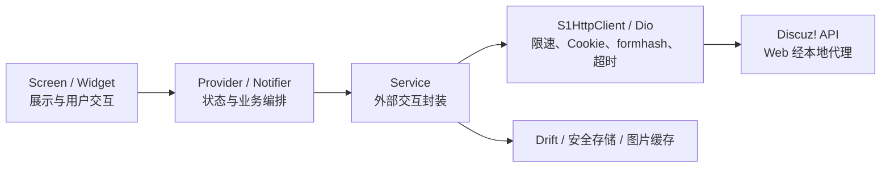

# 架构说明

S1er 遵循单向数据流：Screen / Widget → Provider / Notifier → Service → `S1HttpClient` / Dio → Discuz! API。

## 目录职责

| 目录 | 职责 |
|---|---|
| `lib/config/` | API、环境变量与资源域名等静态配置 |
| `lib/models/` | 不依赖 Flutter 的纯数据模型 |
| `lib/services/` | HTTP、认证、Drift、本地缓存与备份等外部交互 |
| `lib/providers/` | Riverpod 状态与服务编排 |
| `lib/screens/` | 路由页面与页面级组合 |
| `lib/widgets/` | 可复用 UI 组件 |
| `lib/theme/` | Material 3 主题、形状、排版与透明度 token |
| `lib/utils/` | BBCode、导航、格式化等纯工具逻辑 |
| `test/` | model、service、provider、screen、widget 与审计工具测试 |

Provider / Notifier 负责业务编排及 `loading/data/error`、缓存失效和关联刷新，不能退化为 Service 的无状态透传层。纯 UI 状态（动画、展开收起、输入框、滚动）可留在 Widget；网络、持久化、认证、缓存和业务错误必须下沉。

## 关键设计约束

- 所有外部请求统一经过 `S1HttpClient`，共享超时、每秒最多 2 请求的限速、Cookie 与 formhash 处理（升级清单拉取除外，使用独立 Dio）。
- Cookie 不进入 Drift，也不进入 `.s1backup.zip`；密码不做本地持久化。
- Web 代理只允许受控的 S1 资源域名，并将会话 Cookie 保留在内存中。
- UI 使用 Material 3 语义色与排版 token，不在页面和组件中硬编码色板或字号。
- 本地结构化数据走 Drift；不使用 Hive。

更细的技术栈版本锁定与 M3 规范见仓库根目录 [`AGENTS.md`](../AGENTS.md)。

## 主要依赖

与 `pubspec.yaml` / `AGENTS.md` 锁定表一致，包括：`flutter_riverpod` 3.2.1、`dio`、`go_router`、`drift`、`flutter_html`、`ironpress` 等。

Web 开发代理与编译期配置见 [开发指南](development.md)。
